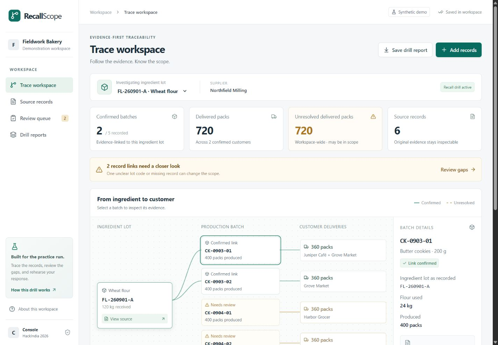

# RecallScope
### Evidence before certainty.

AI-assisted ingredient-to-customer traceability for small food manufacturers, focused on **practice recall drills**.

Built for **Team Console · HackIndia AI-First Startup Hackathon · AI in any startup**.



## What works

- An interactive lot → production batch → delivery map with inspectable source records.
- A synthetic bakery scenario: **720 → 1,080 confirmed delivered packs** after review; **720 → 360 unresolved packs**.
- Original-file storage and SHA-256 fingerprints for uploaded documents.
- Structured CSV import with editable review proposals and explicit approval before graph changes.
- Server-side OpenAI Responses API adapter for PDF, image and text extraction. **Live AI validation requires an API key and is still pending.**
- Operator review of ingredient links and unidentified delivery batches, with decision history.
- Fixed report snapshots that include confirmed and unresolved customers, source references and quantity limitations.
- Server-side persistence, isolated browser sessions, origin checks and revision-based concurrent-write protection.
- Responsive desktop/mobile UI and keyboard-accessible dialogs.

This is a local, single-operator hackathon prototype. It is not a live recall system or a compliance certification.

## Run locally

Node.js 24 LTS is the tested runtime (minimum 22.13). The application lives in `product/`.

```sh
cd product
npm ci
npm run build
node --import ./scripts/sites-env.mjs ./node_modules/wrangler/bin/wrangler.js d1 execute DB --local --config dist/server/wrangler.json --persist-to .wrangler/state --file drizzle/0000_nosy_vulcan.sql
npm run dev
```

Run the schema command **once for a new local database**, not on every restart. The development server prints its local URL (normally http://127.0.0.1:5173). Local D1/R2 data lives in ignored `product/.wrangler/`.

For later runs, only `cd product` and `npm run dev` are needed. Keep the server running while using the preview.

## Demo in two minutes

1. Open the sample workspace and select **FL-260901-A**.
2. See **720 confirmed packs**, **720 unresolved packs**, and **2 confirmed customers**.
3. Inspect CK-0903-01 and its original production sheet.
4. Open **Review queue → Review source & resolve** for CK-0904-01.
5. Compare its recorded **FL-2609O1-A** with the supplier lot **FL-260901-A**. Enter an evidence note and confirm.
6. Confirm the new result: **1,080 confirmed packs, 360 unresolved, 3 customers**.
7. CK-0904-02 remains unresolved because its consumption sheet is missing.
8. Save a drill report. Review history and report snapshots survive a page reload.

All demo entities and records are fictional. The seeded records are pre-authored; loading them is **not** represented as live AI extraction. Mixed uploads retain a synthetic-data warning. Use **Start empty workspace** to work without the fictional dataset.

## Try document import

`sample-records/recallscope-synthetic-import.csv` contains a separate, fictional receipt, batch and delivery. Use **Add records → Structured CSV**. The review shows three records; approval yields **180 delivered packs** for DEMO-FL-01.

Use the exact CSV headers and explicit units. Unknown receipt/production quantities may remain blank and will remain unknown. A delivery needs a known positive whole pack count to be imported. This version tracks **one ingredient lot per production batch**, not multi-lot recipes or rework.

## Connect live AI

Copy `product/.env.example` to `product/.env` and set `OPENAI_API_KEY` server-side. The default configurable model is `gpt-5.4-mini`. Restart the development server after changing configuration. Never put keys in browser code or Git.

The upload screen explicitly asks to send a file to OpenAI. The adapter requests structured output with `store:false`, preserves raw identifier characters, rejects incomplete/unsupported results, and requires review before importing. `store:false` is not a blanket guarantee about all provider retention; review the provider's current data policies before using real documents.

Before the final competition recording, run and record at least one real API extraction against a labelled fixture and compare every field with ground truth. A ChatGPT subscription does not establish that this application's API connection is configured.

Use [the synthetic PDF fixture](sample-records/ai-extraction-fixture.pdf) and its [ground truth](sample-records/expected-ground-truth.md) for this check. In an empty workspace, its three reviewed records should yield 180 confirmed delivered packs and no unresolved deliveries. This fixture has been prepared and inspected; live extraction has not been run.

## Verification

```sh
cd product
npm test
npm run typecheck
npm run build
# With the local server running:
npm run test:api
```

See [validation results](docs/VALIDATION.md), [AI usage](docs/AI-USAGE.md), [demo script](docs/DEMO-SCRIPT.md), [build status](docs/BUILD-STATUS.md), and the [pitch deck](docs/RecallScope-Pitch.pptx).

## Delivery status

**No GitHub push or competition submission has been made.** The required upstream is:
https://github.com/HackIndiaXYZ/ai-first-startup-hackathon-build-a-startup-using-ai-only-console

Public deployment and the final 3–5-minute recorded video remain pending. The official listing also has an unresolved build-window inconsistency: a 48–72-hour format versus September 2–November 1 event dates. Confirm the permitted build window with the organiser before submitting.

## Architecture and limits

React + TypeScript on the Vinext/Cloudflare Worker starter, with D1 for workspace snapshots and R2 for original files. Pure domain functions perform tracing and arithmetic; AI proposes fields, not recall decisions. Session cookies identify separate practice workspaces; they are not multi-user team accounts.

The prototype currently uses a bounded workspace snapshot, not a production inventory database. There are no roles, shared team workspaces, background OCR queues, outbound recall notices, regulatory assertions or verified stock counts. Browser sessions expire after seven days. Uploaded/orphaned storage does not yet have a production retention policy. Use synthetic or properly permissioned test data. Real customer use requires authentication/access, retention/deletion, cost controls and operational validation.

The root MIT license is preserved from the HackIndia team repository. Framework/component dependencies retain their own licenses.
