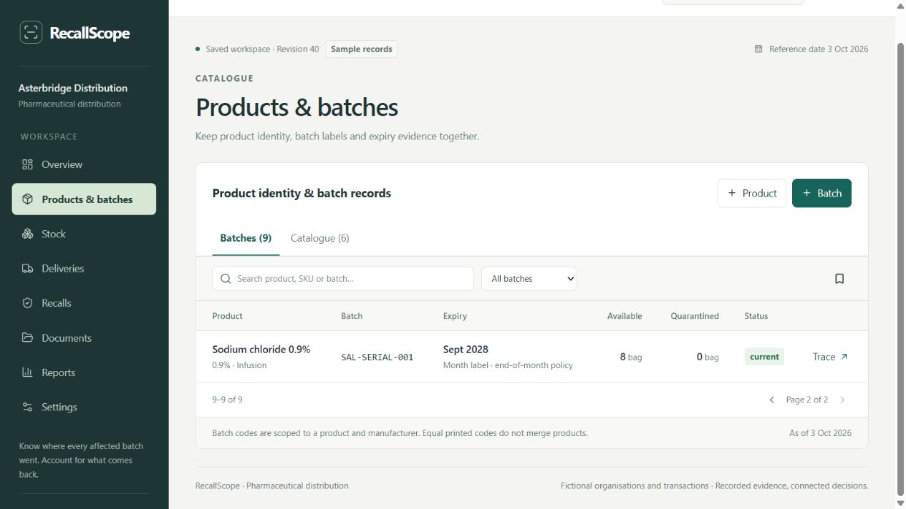
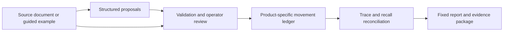

# RecallScope

### Know where every affected batch went. Account for what comes back.

[](https://github.com/HackIndiaXYZ/ai-first-startup-hackathon-build-a-startup-using-ai-only-console/actions/workflows/ci.yml)

**A pharmaceutical distribution workspace for operations and quality teams.** Follow product batches through receiving, warehouses, dispatches and returns; coordinate recall work; export the records behind every quantity.

**Judges need no API key.** Guided document examples and structured CSV imports provide a complete source → review → stock → recall workflow without an AI request. Fireworks and OpenAI remain optional server-side extraction providers.

[Run locally](#run-locally) · [Three-minute walkthrough](#walkthrough-without-an-api-key) · [Verification](docs/PHARMA-VALIDATION.md) · [AI build record](docs/AI-USAGE.md) · [Product and alternatives](docs/PHARMA-ALTERNATIVES.md) · [Development roadmap](docs/PHARMA-DISTRIBUTION-ROADMAP.md) · [Retention and recovery](docs/DATA-RETENTION.md)

**Pharmaceutical edition released 4 October 2026:** [open the live application](https://recallscope.console3096.chatgpt.site/). The bakery implementation remains separate at `/bakery`, with its original records preserved. The updated walkthrough video is on hold at the owner's request; the [September video](docs/VIDEO.md) depicts the earlier bakery edition.



## The product

- **Product and batch identity.** Separate strengths and presentations; preserve original identifiers and month-only expiry labels. The same printed batch code can belong to different products without merging their stock.
- **Recorded stock.** Receipts, reservations, transfers, dispatches, returns, quarantine, adjustments and reversals use explicit product units. Transfers remain in transit until received; held or expired stock cannot be dispatched.
- **Recall accounting.** Identify recorded destinations, capture acknowledgements and partial returns, assign follow-up tasks, and explain outstanding quantities. Historical shipments are not added to current stock.
- **Evidence-led intake.** Inspect pre-filled examples, map CSV columns, or request live AI extraction. Proposed records remain outside stock until a reviewed decision is saved. Original text, uploaded files, corrections and notes remain inspectable.
- **Practical reports.** Preserve fixed case snapshots, export PDF/CSV/JSON and bundle sources with a hash manifest. Keep an account of what changed after a report was created.
- **An operator workspace.** Product, batch, stock and recipient views; searchable records; light, night and system appearance; compact density; accessible dialogs and source details.
- **Access and recovery.** Isolated guest workspaces; account-backed organisations through the hosting sign-in integration; server-enforced roles; export and restore with cross-workspace file protection.
- **Bounded exchange tools.** GS1 identifier decoding, an explicit EPCIS ObjectEvent exchange subset and temperature CSV review. These tools expose their supported scope and do not certify authenticity, medicine safety or regulatory compliance.

All supplied organisations and transactions are fictional sample records. The app records operational evidence and human decisions; it does not decide whether a medicine is safe to use.

## Walkthrough without an API key

1. Open the pharmaceutical workspace. The completed case shows **1,000 boxes received, 600 historically dispatched, 600 returned and 1,000 recorded in quarantine**, across four customer sites. These measures are not additive: the returned stock is already part of current stock.
2. Open the paracetamol batch **PCR-260901**. Follow the supplier, Central/North locations and four recipients. Open its source records. The amoxicillin product has the same printed batch code and remains outside this case.
3. Open **Document intake → Guided examples → Goods received**. Read the notice: **“Guided example — pre-filled records; no AI request is made.”** Inspect the original CSV, matching identifiers and proposed 40-box receipt.
4. Enter a review note and approve. The separate available paracetamol batch **PCR-261001** increases from **400 to 440 boxes**. Repeating the same document cannot post another receipt.
5. Open the completed case report and export its PDF or evidence package. The earlier partial snapshot remains unchanged.
6. For an interactive returns demonstration, load the **active recall** sample. It has **100 returned and 500 outstanding boxes**. Review the partial-return example for **20 boxes**: after approval, returns become **120**, outstanding becomes **480**, and stock remains quarantined.

Sample reset deliberately replaces the working sample scenario. Use a workspace backup first if you want to retain your changes.

## How it works



React and TypeScript run on Vinext and Cloudflare Workers. D1 stores versioned pharmaceutical workspace records, sessions, memberships and request identities. R2 stores source files and bounded review drafts. Mutations use workspace revision checks and atomic persistence; repeat request IDs do not repeat stock posting. The pharmaceutical schema is separate from the retained bakery schema.

The core accounting rules are ordinary deterministic code. AI can propose fields; it does not approve records, silently match similar identifiers or change stock on its own.

## Run locally

Use Node.js 24 LTS (minimum 22.15). The application lives in `product/`.

```sh
cd product
npm ci
npm run build
node --import ./scripts/sites-env.mjs ./node_modules/wrangler/bin/wrangler.js d1 execute DB --local --config dist/server/wrangler.json --persist-to .wrangler/state --file drizzle/0000_nosy_vulcan.sql
node --import ./scripts/sites-env.mjs ./node_modules/wrangler/bin/wrangler.js d1 execute DB --local --config dist/server/wrangler.json --persist-to .wrangler/state --file drizzle/0001_long_silver_surfer.sql
node --import ./scripts/sites-env.mjs ./node_modules/wrangler/bin/wrangler.js d1 execute DB --local --config dist/server/wrangler.json --persist-to .wrangler/state --file drizzle/0002_real_shinobi_shaw.sql
node --import ./scripts/sites-env.mjs ./node_modules/wrangler/bin/wrangler.js d1 execute DB --local --config dist/server/wrangler.json --persist-to .wrangler/state --file drizzle/0003_fuzzy_shatterstar.sql
npm run dev
```

Apply each migration **once** to a new local database. Existing installations apply only unapplied migrations. The server prints its URL, normally [localhost:5173](http://localhost:5173/). Local D1/R2 state lives in ignored `product/.wrangler/`. On later starts, run `npm run dev` from `product/` and keep the process running.

The local hosting sign-in shim supports development checks; production identity comes from the hosting authentication integration. It is not a standalone email/password service.

## Optional live AI extraction

Guided examples and CSV work when no provider is configured. Live extraction requires an explicit choice to send the selected document to the configured service. Keep keys in ignored local configuration or private hosting secrets—never Git, screenshots or browser code.

For Fireworks, configure `AI_PROVIDER=fireworks`, `FIREWORKS_API_KEY` and optionally `FIREWORKS_MODEL`. For OpenAI, configure `AI_PROVIDER=openai`, `OPENAI_API_KEY` and optionally `OPENAI_MODEL`. Current code defaults are `accounts/fireworks/models/kimi-k2p6` and `gpt-5.4-mini`; model availability is controlled by the provider. An explicit provider choice never silently falls back to another service.

Text, CSV, images and bounded PDF documents can produce proposals. Fireworks PDF/WebP inputs use rendered images; every PDF page is checked against the original. Structured schemas, exact source quotes, product-scoped matching and review apply independently of the model. Live extraction has timeouts plus workspace and shared daily request allowances. No request is made when selecting a guided example.

The pharmaceutical adapters have mocked-provider checks. The [September Fireworks observation](docs/LIVE-AI-VALIDATION.md) tested the earlier bakery schema and must not be represented as a pharmaceutical extraction benchmark.

## Verification and project materials

From `product/`, run:

```sh
npm test
npm run typecheck
npm run build
npm run test:api
```

The API checks require the local server. They use isolated synthetic sessions and do not call paid AI providers. [Pharmaceutical verification](docs/PHARMA-VALIDATION.md) separates automated results, browser journeys, standards-subset checks and historical live AI observations.

- [Current demonstration script](docs/DEMO-SCRIPT.md)
- [AI usage and development decisions](docs/AI-USAGE.md)
- [Official-source alternatives and commercial hypothesis](docs/PHARMA-ALTERNATIVES.md)
- [Roadmap and implementation scope](docs/PHARMA-DISTRIBUTION-ROADMAP.md)
- [Earlier bakery video and captions](docs/VIDEO.md)
- [Pharmaceutical pitch deck](docs/RecallScope-Pharma-Pitch.pptx)
- [Credential handling and rotation](docs/SECRET-HANDLING.md)

Built for **Team Console · HackIndia AI-First Startup Hackathon**. The original [MIT license](LICENSE) is preserved; dependencies retain their own licenses.
