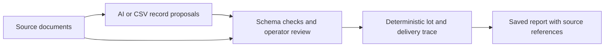

# RecallScope
### Evidence before certainty.

[](https://github.com/HackIndiaXYZ/ai-first-startup-hackathon-build-a-startup-using-ai-only-console/actions/workflows/ci.yml)

**[Open RecallScope](https://recallscope.console3096.chatgpt.site)** — explore the complete bakery workspace, inspect its source records and save a trace report.

[Watch the demo · 4:40](https://d2ol7oe51mr4n9.cloudfront.net/user_3GIHIHlGYWNEBJDIfcsqR2O7n0p/78fee478-81f8-44f8-ab66-1968689ab191.mp4) · [Quick start](#run-locally) · [Showcase walkthrough](#demo-in-two-minutes) · [AI extraction](#connect-ai-extraction) · [Pitch deck](docs/RecallScope-Pitch.pptx) · [AI build report](docs/AI-USAGE.md)

Follow an ingredient from receiving to production to customer deliveries—with the source records beside the trace.

RecallScope brings AI-assisted document intake, an interactive trace map and saved reports into a workspace for practice recall drills. Built for **Team Console · HackIndia AI-First Startup Hackathon · AI in any startup**.

## Explore the bakery showcase

The supplied sample workspace contains seven source documents. Select ingredient lot **FL-260901-A** to explore **1,440 confirmed delivered packs, four production batches and four customer destinations**. All included businesses and transactions are fictional.

- **Follow a delivery.** Select a batch or destination on the map and inspect the records supporting its ingredient connection.
- **Read the source.** Search receiving logs, production sheets and dispatch records in the document library.
- **Keep a report.** Save a scope snapshot, read it in the workspace and compare saved reports for the same lot.
- **Make it comfortable.** Choose light, night or system appearance, adjust density and personalize the workspace name.
- **Bring in more records.** Import CSV or use AI document extraction, inspect the proposed fields and approve them before they enter the trace.

The showcase is pre-authored. Loading it does not make an AI request. Separately observed Fireworks extraction results are documented in the [AI validation record](docs/LIVE-AI-VALIDATION.md).

## Demo in two minutes

1. Open the supplied workspace and select **FL-260901-A**.
2. Read the scope: **1,440 packs · 4 batches · 4 destinations**. Each delivery in this fictional scenario has a supported ingredient link.
3. Select a production batch on the trace map, then open its source record. Follow the path through to its customer delivery.
4. Open **Documents** to explore the workspace's **seven source documents**. Search a batch code or use a document category to find the corresponding record.
5. Choose **Create report**, then **Open report** to read the saved scope and supporting references. Saved snapshots survive a page reload.
6. Try night mode or open **Preferences** to adjust appearance, density and display names.

Use **Preferences → Workspace data → Load sample records** to restore the showcase. The action asks you to confirm replacement of the current records and reports. **Clear workspace** provides an empty starting point for your own imports. Mixed imports retain the sample-data disclosure.

## Run locally

Node.js 24 LTS is the tested runtime (minimum 22.13). The application lives in `product/`.

```sh
cd product
npm ci
npm run build
node --import ./scripts/sites-env.mjs ./node_modules/wrangler/bin/wrangler.js d1 execute DB --local --config dist/server/wrangler.json --persist-to .wrangler/state --file drizzle/0000_nosy_vulcan.sql
node --import ./scripts/sites-env.mjs ./node_modules/wrangler/bin/wrangler.js d1 execute DB --local --config dist/server/wrangler.json --persist-to .wrangler/state --file drizzle/0001_long_silver_surfer.sql
npm run dev
```

Run both schema commands **once for a new local database**, not on every restart. For an existing installation, apply only the new migration. The development server prints its local URL (normally http://127.0.0.1:5173). Local D1/R2 data lives in ignored `product/.wrangler/`.

For later runs, only `cd product` and `npm run dev` are needed. Keep the server running while using the preview. From `product/`, `npm run build` followed by `npm start` opens the built application in a local Worker preview.

## Connect AI extraction

The sample workspace and CSV import work without an API key. For AI extraction, copy `product/.env.example` to ignored `product/.env`, set `AI_PROVIDER=fireworks` and provide `FIREWORKS_API_KEY`. The default model is `accounts/fireworks/models/kimi-k2p6`. Restart the local server after changing configuration. Keep credentials out of browser code and Git.

The upload screen identifies the provider before consent. Fireworks reads text and images; PDFs are rendered into page images, with up to six pages per PDF. The original document, supplied page images and extracted proposals remain available for review. You approve the records before the trace changes.

An actual Fireworks run on the [single-page fictional PDF](sample-records/ai-extraction-fixture.pdf) returned three record proposals. Reviewed import produced **180 confirmed delivered packs and zero unresolved deliveries**. This is a separate fixture from the bakery showcase. See [observed results and technical scope](docs/LIVE-AI-VALIDATION.md).

OpenAI is also configurable: set `AI_PROVIDER=openai`, provide `OPENAI_API_KEY` and optionally set `OPENAI_MODEL` (default `gpt-5.4-mini`). The [AI build report](docs/AI-USAGE.md) distinguishes implemented provider support from observed live tests. Provider selection is explicit.

For CSV, choose **Add records → Import CSV** and use [the supplied three-record example](sample-records/recallscope-synthetic-import.csv). Review and approve the receipt, production and dispatch records to trace **180 packs** for its separate lot, `DEMO-FL-01`.

## How it works



AI proposes record fields. The operator reviews the evidence. Code calculates the recorded scope. Original source values stay separate from review decisions, and saved reports retain their own snapshots.

React and TypeScript run on a Vinext/Cloudflare Worker foundation, with D1 workspace persistence and R2 document storage. The [technical validation](docs/VALIDATION.md) and [build record](docs/BUILD-STATUS.md) describe the single-operator, one-ingredient-per-batch scope.

<a id="delivery-status"></a>

## Project materials

- [Product demo · 4:40](https://d2ol7oe51mr4n9.cloudfront.net/user_3GIHIHlGYWNEBJDIfcsqR2O7n0p/78fee478-81f8-44f8-ab66-1968689ab191.mp4) — a narrated walkthrough of the trace workspace, document intake and AI-led build
- [Video chapters, captions and production files](docs/VIDEO.md) · [Showcase script](docs/DEMO-SCRIPT.md)
- [Editable pitch deck](docs/RecallScope-Pitch.pptx)
- [Complete sample report](sample-records/showcase/trace-report.md) and [source records](sample-records/showcase)
- [AI tools, prompts and development decisions](docs/AI-USAGE.md)
- [Verification record](docs/VALIDATION.md) and [live AI evidence](docs/LIVE-AI-VALIDATION.md)
- [Build and release record](docs/BUILD-STATUS.md)
- [Submission materials](docs/SUBMISSION.md)

To run the checks from `product/`: `npm test`, `npm run typecheck`, `npm run build`, and—with the local server running—`npm run test:api`.

The original [MIT license](LICENSE) from the HackIndia team repository is preserved. Framework and component dependencies retain their own licenses.
