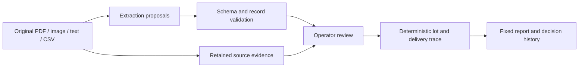

# RecallScope
### Evidence before certainty.

[](https://github.com/HackIndiaXYZ/ai-first-startup-hackathon-build-a-startup-using-ai-only-console/actions/workflows/ci.yml)

[Quick start](#run-locally) · [Demo walkthrough](#demo-in-two-minutes) · [Live AI evidence](docs/LIVE-AI-VALIDATION.md) · [Pitch deck](docs/RecallScope-Pitch.pptx) · [AI build report](docs/AI-USAGE.md)

AI-assisted ingredient-to-customer traceability for small food manufacturers, focused on **practice recall drills**.

Built for **Team Console · HackIndia AI-First Startup Hackathon · AI in any startup**.

A quality or operations lead can bring existing supplier receipts, production sheets and dispatch records into one trace, inspect the source behind each link, and preserve the remaining uncertainty in a report.

The workspace includes light, night and system appearance, device-local personalization, search, review filters and comparisons between saved reports.

## What works

- An interactive lot → production batch → delivery map with inspectable source records.
- A synthetic bakery scenario: **720 → 1,080 confirmed delivered packs** after review; **720 → 360 unresolved packs**.
- Original-file storage and SHA-256 fingerprints for uploaded documents.
- Structured CSV import with editable review proposals and explicit approval before graph changes.
- Live Fireworks extraction for PDF, image and text, with provider-specific consent and reviewed imports. The OpenAI Responses API option remains available.
- Operator review of ingredient links and unidentified delivery batches, with decision history.
- Fixed report snapshots that include confirmed and unresolved customers, source references and quantity limitations.
- Server-side persistence, isolated browser sessions, origin checks and revision-based concurrent-write protection.
- Responsive desktop/mobile UI and keyboard-accessible dialogs.
- Persistent light/night/system appearance and comfortable/compact density.
- Editable workspace/display names, quick search with Ctrl/⌘ K, document categories and review filters.
- In-app report reading, same-lot snapshot comparisons and a shortcut to the latest decision history.

**Current scope:** a single-operator workspace for practice recall drills. It does not send recall notices or certify safety/compliance. Synthetic QA and a permissioned manufacturer pilot are different evidence levels; no real customer validation is claimed.

## Run locally

Node.js 24 LTS is the tested runtime (minimum 22.13). The application lives in `product/`.

```sh
cd product
npm ci
npm run build
node --import ./scripts/sites-env.mjs ./node_modules/wrangler/bin/wrangler.js d1 execute DB --local --config dist/server/wrangler.json --persist-to .wrangler/state --file drizzle/0000_nosy_vulcan.sql
npm run dev
```

Run the schema command **once for a new local database**, not on every restart. The development server prints its local URL (normally http://127.0.0.1:5173). Local D1/R2 data lives in ignored `product/.wrangler/`.

For later runs, only `cd product` and `npm run dev` are needed. Keep the server running while using the preview.

## Demo in two minutes

1. Open the sample workspace and select **FL-260901-A**.
2. See **720 confirmed packs**, **720 unresolved packs**, and **2 confirmed customers**.
3. Inspect CK-0903-01 and its original production sheet.
4. Open **Needs review → Review source & resolve** for CK-0904-01.
5. Compare its recorded **FL-2609O1-A** with the supplier lot **FL-260901-A** and the [synthetic ground truth](sample-records/expected-ground-truth.md). Explicitly choose **FL-260901-A**, enter the supporting evidence note and confirm. Similar spelling alone is not proof.
6. Confirm the new result: **1,080 confirmed packs, 360 unresolved, 3 customers**.
7. CK-0904-02 remains unresolved because its consumption sheet is missing.
8. Choose **Create report**, then **Open report** to inspect the saved snapshot. To see what changed, save one report before step 4 and another after step 6. Review history and report snapshots survive a page reload.

All demo entities and records are fictional. The seeded records are pre-authored; loading them is **not** represented as live AI extraction. Mixed uploads retain a sample-data label. Use **Preferences → Workspace data → Clear workspace** to work without the fictional dataset; this explicitly confirms replacement of the current records and reports. **Load sample records** is in the same section.

## Try document import

`sample-records/recallscope-synthetic-import.csv` contains a separate, fictional receipt, batch and delivery. Use **Add records → Import CSV**. The review shows three records; approval yields **180 delivered packs** for DEMO-FL-01.

Use the exact CSV headers and explicit units. Unknown receipt/production quantities may remain blank and will remain unknown. A delivery needs a known positive whole pack count to be imported. This version tracks **one ingredient lot per production batch**, not multi-lot recipes or rework.

## Make the workspace yours

Use the moon/sun button for a quick appearance switch, or open **Preferences** for Light, Night or System and layout density. Appearance and display names are stored on this device; names do not identify an authenticated team account or rewrite source records. System appearance follows device changes. The sample-data disclosure stays independent of personalization.

**Find in workspace** (Ctrl/⌘ K) searches lot codes, suppliers, batches, customers and original document text. Document categories derive from the linked receipt/production/delivery records, so one document can appear in several categories. Search and filters do not change trace calculations. **Needs review** supports issue filters and orders ingredient-link items by recorded unresolved packs.

## Connect live AI

Copy `product/.env.example` to ignored `product/.env`. Set `AI_PROVIDER=fireworks` and `FIREWORKS_API_KEY` for Fireworks; the default model is `accounts/fireworks/models/kimi-k2p6`. To use OpenAI, set `AI_PROVIDER=openai` and `OPENAI_API_KEY`; `OPENAI_MODEL` defaults to `gpt-5.4-mini`. Explicit provider choices never silently fall back to another service. Restart the development server after configuration changes. Never put keys in browser code or Git. The provided local development key is not included in the source package.

The upload screen names the selected provider before consent. Both adapters request structured output, preserve raw identifiers, reject incomplete/unsupported results, and require review before importing. OpenAI requests use `store:false`; this option is not sent to Fireworks. Review the chosen provider's current data policies before using real documents.

Fireworks PDFs are rendered in the browser, with a six-page limit and no skipped pages. The server independently checks the original PDF page count against the received JPEG pages. The original PDF and each supplied image are stored with SHA-256 fingerprints; operators must compare the images and transcript against the original. Fingerprints identify stored bytes, not OCR accuracy or proof that a raster faithfully represents its source. WebP is converted to JPEG. OpenAI receives original PDFs/images directly.

The [synthetic PDF fixture](sample-records/ai-extraction-fixture.pdf) was extracted through Fireworks and reviewed in the actual UI: three records, 180 confirmed packs and no unresolved deliveries. See [live AI validation](docs/LIVE-AI-VALIDATION.md) for the evidence and limitations. Live OpenAI extraction remains untested because no OpenAI key is configured.

For a production build preview, run `npm run build` and then `npm start`. The preview reads the private `.env` from the application directory. This starts a local Worker; it does not publish the app.

## Verification

```sh
cd product
npm test
npm run typecheck
npm run build
# With the local server running:
npm run test:api
```

See [validation results](docs/VALIDATION.md), [AI usage](docs/AI-USAGE.md), [demo script](docs/DEMO-SCRIPT.md), [build status](docs/BUILD-STATUS.md), and the [pitch deck](docs/RecallScope-Pitch.pptx).

See the [76-item readiness checklist](docs/CHAMPIONSHIP-CHECKLIST.md), [printable checklist](docs/CHAMPIONSHIP-CHECKLIST.pdf), and [alternative comparison / pilot plan](docs/PILOT-AND-ALTERNATIVES.md) for the remaining evidence and release work.

## Delivery status

| Deliverable | Status / evidence |
|---|---|
| Source code | This official Team Console repository; upstream MIT history preserved |
| Local verification | 42 domain/provider tests, type checking, production build and API integration passed; [full record](docs/VALIDATION.md) |
| Live product AI | Fireworks verified on labelled synthetic documents; [observed results and limits](docs/LIVE-AI-VALIDATION.md) |
| Pitch deck | [Eight-slide deck](docs/RecallScope-Pitch.pptx) |
| AI usage report | [Tools, prompts, decisions and fixes](docs/AI-USAGE.md) |
| Public deployed app | Pending; localhost is not a judge-accessible deployment |
| Final 3-5-minute video | Pending; [recording script](docs/DEMO-SCRIPT.md) is ready |
| Manufacturer validation | Pending; [permissioned pilot protocol](docs/PILOT-AND-ALTERNATIVES.md) is prepared |
| Competition submission | Not submitted |

The owner authorized this GitHub publication on 12 September 2026. Deployment and competition submission require separate authorization. Earlier audit documents and the checklist PDF describe the pre-publication snapshot; this table is the current delivery status.

The official listing has an unresolved build-window inconsistency: a 48-72-hour format versus September 2-November 1 event dates. Confirm the permitted window and final submission procedure with the organizer before submitting. [Official event](https://hackindia.org/2026/ai-first-startup-hackathon-build-a-startup-using-ai-only)

## Architecture and limits



AI proposes transcription; explicit review and deterministic rules establish the recorded scope. Unknown links stay unresolved until supported by evidence.

React + TypeScript on the Vinext/Cloudflare Worker starter, with D1 for workspace snapshots and R2 for original files. Pure domain functions perform tracing and arithmetic; AI proposes fields, not recall decisions. Session cookies identify separate practice workspaces; they are not multi-user team accounts.

The current implementation uses a bounded workspace snapshot rather than a production inventory database. There are no roles, shared team workspaces, background OCR queues, outbound recall notices, regulatory assertions or verified stock counts. Browser sessions expire after seven days. Uploaded/orphaned storage does not yet have a production retention policy. Use synthetic or properly permissioned test data. Real customer use requires authentication/access, retention/deletion, cost controls and operational validation.

The root MIT license is preserved from the HackIndia team repository. Framework/component dependencies retain their own licenses.
